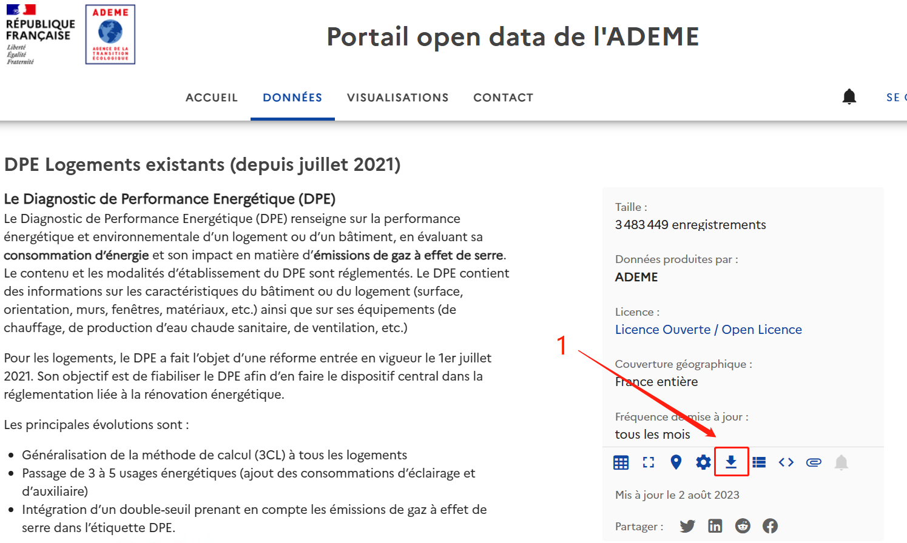
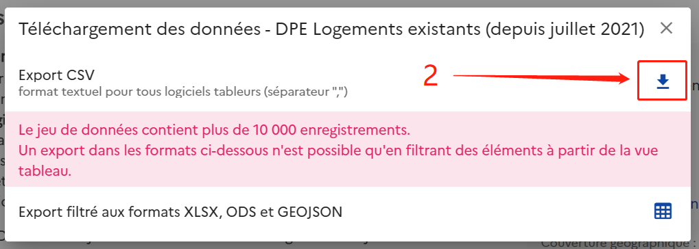
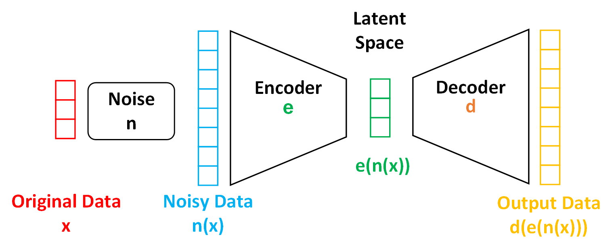
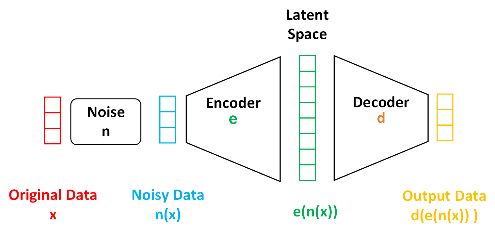
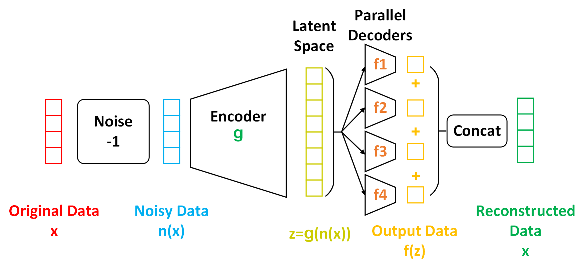
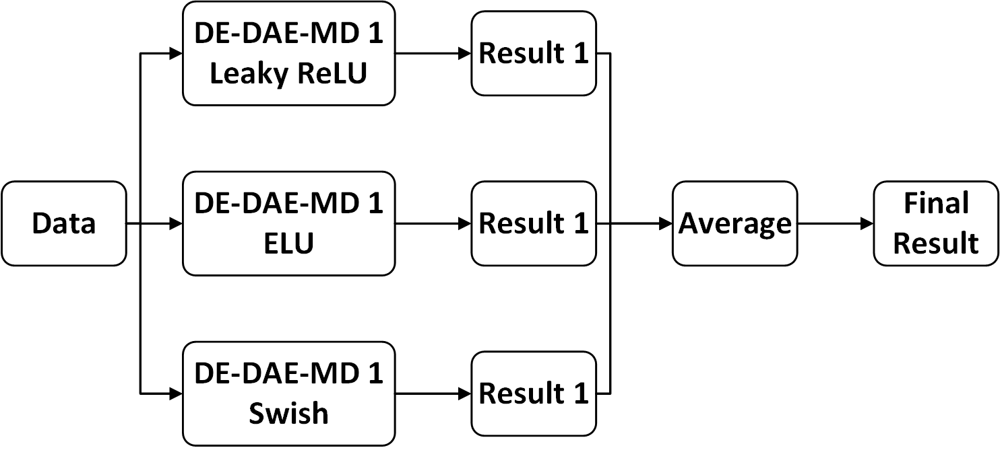

# DE-DAE-MD-Data-Interpolation
This is a repository for the dissertation: Enhancing Data Interpolation with Dimension-Enhanced Denoising Autoencoder with Multi-Decoder (DE-DAE-MD) on the French Building Energy Performance Dataset. Detailed experimental ideas and analyses of the results can be found in the paper. This README file mainly provides the code and how it is reproduced.

## Index
* [Environment](#Environment)
    * Local
    * Colab
* [Dataset](#Dataset)
    * Source
    * Other download links
    * Link for the dataset description files
* [Model](#Model)
    * DAE(baseline model)
    * DE-DAE
    * DE-DAE-MD
    * Ensemble
* [Document Description](#Document-Description)
    * First-level catalogue
    * Second-level catalogue


## Environment
### Local
OS: Win 10/11
Frame: Tensorflow
GPU： Nvidia 3080Ti
Use the following command to configure the environment:
```
pip install -r requirements.txt
```


### Colab
Google Colab is recommended. The recommended runtime configuration is high RAM + Nvidia A100.


## Dataset
### Source
The research data comes from a dataset in the open database of the French Environment and Energy Management Agency (ADEME): Energy Performance Diagnostics of Existing Housing. The link is shown below :
```
https://data.ademe.fr/datasets/dpe-v2-logements-existants
```
The open-source database website provides a variety of data formats, please select the CSV format when downloading. Download steps are shown below:


### Quick download link for the dataset
If your dataset download speed is slow, you can use the link below to download the dataset:
```
https://drive.google.com/drive/folders/13IuaDAiNrfigCOLLU_NYZVKhuoBQ4HwV?usp=drive_link
```
It is important to note that the data in this link was last updated in May 2023. If you'd like to access the dataset containing the latest data, please follow the steps on the image to download it.

### Link for the dataset description files
If you would like detailed information about the specifics of each variable in the dataset (including how certain variables are calculated), please download the following documents (note that these documents are also available for download from the data website):
```
https://drive.google.com/drive/folders/1nnXE7sM53MkJZ5vm7sI9CnkXm42pLESY?usp=drive_link
```


## Model
This repository provides all the model codes in the paper, and the models are divided into the following four main categories:
### 1. DAE(Baseline Model)
The model is a conventional DAE, consisting of an encoder and a decoder.

### 2. Dimension Enhanced DAE
Dimension Enhanced DAE (DE-DAE) improves the traditional DAE by increasing the dimension of the hidden space. DE-DAE can contain more information and is more favourable for data interpolation.

### 3. DE-DAE with Multi-decoder
DE-DAE with Multi-decoder (DE-DAE-MD) further improves DE-DAE. It adds several parallel decoders, each responsible for decoding different data types. This enhances the data reduction capability of the decoders.

### 4. Ensemble Model
We used the Ensemble method to enhance the model's data interpolation capability further. We modified the activation functions in DE-DAE-MD. In the Ensemble Model, we used three DE-DAE-MD models with different activation functions and used the average of their results as the final prediction.

## Result
Since the code uses a Dropout layer and the training data is randomly divided, this results in the training and testing results not being the same each time. Therefore, it is reasonable to expect an error of up to 2% if you reproduce the code.
The results from the experimental paper are saved in DPE_Data_imputation.ipynb. You can click on the file to view the results in it.


## Document Description
### First-level catalogue
The content contained in the first-level catalogue is shown below:

| File/folder name | Details | 
|---|---
|DPE_Data_imputation.ipynb |  Contains all the code and the same results as in the paper |
| DAE |  Code for DAE; contains five subfolders, each containing three python files |
| DE-DAE |  Code for DE-DAE; contains five subfolders, each containing three python files |
| DE-DAE-MD |  Code for DE-DAE-MD; contains five subfolders, each containing three python files |
| Ensemble Model |  Code for Ensemble Model; contains five subfolders, each containing three python files |
| Notebook | Code in ipynb format |

### Second-level catalogue
Note that DAE, DE-DAE, DE-DAE-MD and Ensemble each contain five subfolders named Carpentry, ECS, Floor, Roof, and Walls. The five different subfolders represent five different reconstructed datasets.
Each subfolder contains three different Python files. The naming and role of each file is shown below:
| File name | Functions | 
|---|---
| models.py | Includes the model, loss function, and all functions and classes associated with the training and prediction process |
| result.py |  Includes the main function, which can be run to obtain the corresponding experimental results. |
| utilities.py |  Includes data preprocessing and other output functions |

In each Python file, I added detailed comments, and for files with a large number of lines, I also added an index at the beginning of the file for easy access to the code for the corresponding function.

Depending on your computer environment, you can choose to run ipynb files or py files.


